# Game Plan Documentation

## Purpose

Game Plan simplifies and streamlines the the process of organising board game events.

The purpose of the app is to empower board game hobbyists to connect, discover, host and join game events within their local communities, with a focus on streamlining the event creation process. The app aims to make make it effortless to be a part of these events while removing the typical barriers of scheduling conflicts and logistical challeneges. For example, a game must meet within the minimim and maximum player limitation, someone must own the board game, there but be a viable hosting location in order to be played.

## Target Audience

Game Plan targets an audience of board game enjoyers of all levels, who are seeking to connect with people through local events and discover new games, while the app takes care of the logistics of event management.

The target audience can be broken down further in these categories:

- Board game hobbyists: Those passionate about board games, seeking a convenient way to host and join game events
- Casual gamers: People interested in trying new games and meeting up with people in a social evironment
- Game groups and clubs: Organisations that want to streamline event scheduling, communications, and member engagement.

## Functionality and Features

User Profiles:

- Create personalised profiles with game collections, preferences

Game Event Creation:

- Search and select the preferred game from the BoardGameGeek API
- Specify game, time, location, player minimum and maximum count
- Save the game event as a draft before publishing it for viewing

Game Event Discovery:

- Browser a currated list of upcoming game events, filtered by game and date
- See a brief overview of game names, date and time lcation, host, players going
- Access detailed event information when clicking into the event
- RSVP as 'Going', 'Leave Event'

Game Collection Management:

- Build a digital library of owned gamed
- Click into it to get detailed game information as a link to BoardGameGeek

Event Page:

- Edit Profile
- Games Owned
- My Events
- Event Drafts
- Discover Events
- Discover Games
- Logout
- NEW EVENT

New Event:

- Search for Game Name
- Date
- Time
- Location
- Duration
- Description
- Host
- Guests
- Minimum players
- Maximum players
- Is event private
- Publish event
- Preview Event
- Save as Draft

Events Page:

- Event Name
- Hosted by
- Game Image
- Date
- Time
- Duration
- Location
- Description
- Capacity
- Edit event (host only)
- Cancel event (host only)
- Join Game (guest only)

## Tech Stack

Core Framework:

- MERN:
  - MongoDB
  - Express.js
  - React.js
  - Node.js

API Intergrations:

- BoardGameGeek API

Frontend Development:

- Languages:
  - HTML5
  - CSS3
  - JavaScript
  - XML
- Library / Framework:
  - React.js
  - React Router
  - react-calendar
  - xml2js

Backend Development:

- Runtime:
  - Node.js
  - Nodemon
- Framework:
  - Express.js
- Data Formats:
  - JSON
  - XML
- Database Interaction:
  - Mongoose
  - Axios
  - bcryptjs
  - JWT
  - dotenv

Deployment:

- Heroku
- Netlify

DevOps and Version Control:

- Git
- GitHub
- Visual Studio Code

Testing:

- Bruno
- Jest
- Mocha
- Cypress

Planning and Management:

- Trello
- Miro
- Discord

Design and Prototyping:

- Procreate
- Figma
- Miro

## Application Architechure Diagram

1. User interacts with the application via web browser. Browser will display a webpage
2. React front-end framework handling user interface. Sends API requests to the server and receives JSON responses
3. Express Node.js back-end framework recieves API requests from React front-end, processes and sends JSON responses
4. JWT Service as part of express server handles user authentication and authorisation. Generates JWT tokens for user
5. Externally hosted API providing boardgame data when presented with valid url path requested by the server.
   Responds with XML data
6. Database stores user data, events and board game collections.
   CRUD operations and queries performed by the server

## Dataflow Diagram

#### Individual Dataflows:

1. User Registration  
   
2. User Login  
   
3. View Games in users collection  
   
4. User joins an event  
   
5. User creates an event  
   
6. User views their booked events  
   
7. User searches for public events  
   
8. Host user edits an event  
   
9. Host user deletes an event  
   
10. User searches for a boardgame to add to collection  
    
11. User adds a boardgame to collection  
    
12. User leaves an event where they are not the host  
    

## User Stories

A simple version user stories:

- As a non-user, I want to be able to register as a user, so that I can perform user operations
- As a user, I want to be able to login to my profile, so I can see my collection and join events
- As a user, I want to be able to create a new event, so I can share this with other users to join
- As a host, I want to be able to share an event link to other users, so they can join my event
- As a user, I want to search for events, so that I can join.
- As a host, I want to be able to edit or delete my event, so that the details are changed
- As a user, I want to be able to search for boardgames, so that I can add these to my collection
- As a user, I want to be able to leave the event, so that it can be removed from my event list

Utilising Agile Methodologies, we have broken down the project further as follows:

### Epics:

- Account Management: User registration, login, and logout functionality
- Navigation: Menu and navigation elements for the platform
- User Profile Management: Viewing and editing basic user profile information
- Game Discovery: Browsing, seraching, and viewing details about board games
- Game Collection Management: Managing a personal collection of owned board games
- Event Participation: Joining, leaving, and viewing events.
- Event Creation and Management: Covers event creation, sharing, editing, deletion, and searching

### Initiatives:

- Launch MVP: The overcharing initiative is to release the Minimum Viable Product (MVP) with core functionality.

### Personas:

#### Persona 1: The Avid Board Gamer

**Name:** Alex Thompson

**Age:** 30

**Occupation:** Software Developer

**Interests:** Complex strategy games, organizing game nights, discovering new board games

**Bio:** Alex is a passionate board game enthusiast who enjoys exploring intricate strategy games and hosting game nights with friends. With a busy job as a software developer, Alex values efficient tools that help streamline the process of organizing and managing board game events.

**Goals and Motivations:**

- To easily find and join board game events in the local community
- To host events without worrying about logistical challenges
- To connect with other board game enthusiasts and share gaming experiences

**User Stories:**

- Story 1: As a non-user, I want to register for an account by providing my email and password, so that I can access the platform's features.
- Story 6: As a user, I want to see a navigation menu that allows me to access various sections.
- Story 24: As a host, I want to create a new event using the 'New Event' form.
- Story 31: As a host, I want to edit the details of my event.

#### Persona 2: The Casual Gamer

**Name:** Sarah Williams

**Age:** 25

**Occupation:** Marketing Assistant

**Interests:** Socializing, casual board games, trying new activities

**Bio:**
Sarah enjoys spending her weekends meeting new people and trying out different board games. As a casual gamer, she appreciates games that are easy to learn and fun to play in a social setting. She often looks for local events where she can join in and play without the hassle of organizing.

Goals and Motivations:

- To discover new and interesting board games
- To meet new people and socialize through board game events
- To join events without worrying about the logistics

User Stories:

- Story 9: As a user, I want to browse through the Discover Games page.
- Story 20: As a user, I want to RSVP to an event as 'Going'.
- Story 22: As a user, I want to leave an event that I previously joined with a 'Leave Event' button.
- Story 13: As a user, I want to view my 'Owned Games' collection.

#### Persona 3: The Game Group Organizer

**Name:** Mark Johnson

**Age:** 35

**Occupation:** Teacher

**Interests:** Running a local board game club, strategy games, organizing events

**Bio:**
Mark is the leader of a local board game club that meets regularly to play a variety of games. He is responsible for organizing events, managing club communications, and ensuring everything runs smoothly. Mark needs an efficient way to schedule events, communicate with members, and keep track of RSVPs and game logistics.

**Goals and Motivations:**

- To streamline the event scheduling process for the club
- To effectively communicate with club members and manage RSVPs
- To ensure all events meet the necessary logistical requirements

**User Stories:**

- Story 16: As a user, I want to view the 'My Events' section.
- Story 25: As a host, I want to add a game in the 'Game Name' section by clicking the field, searching, and selecting the preferred game from my 'Owned Games'.
- Story 28: As a host, I want to save the game event as a draft before publishing it for viewing.
- Story 33: As a host, I only want my event to go ahead if it meets the minimum player requirement as per the capacity status icon.

#### Persona 4: The Newbie

**Name:** Emily Carter

**Age:** 22

**Occupation:** College Student

**Interests:** Learning new games, meeting new friends, casual social activities

**Bio:**
Emily is new to the world of board games and is looking for ways to learn and meet new people. As a college student, she has a flexible schedule and is eager to find local events where she can play and socialize without the pressure of hosting or managing events.

**Goals and Motivations:**

- To learn about different board games and how to play them
- To find and join local board game events easily
- To connect with other beginners and make new friends

**User Stories:**

- Story 10: As a user, I want to search for games in the library by name.
- Story 19: As a user, I want to view detailed information about an event.
- Story 21: As a user, I want to join an event by clicking on the event link or finding it through search.
- Story 23: As a user, I only want to be able to join an event if the maximum player limit is not reached indicated by the capacity status icon.

### Agile User Stories:

#### Epic: Account Management

- Story 1: As a non-user, I want to register for an account by providing my email and password, so that I can access the platform's features
- Story 2: As a logged-out user, I want to log in with my email and password, so that I can access my profile and content
- Story 3: As a user, I want to be able to log out from my account
- Story 4: As a user, I want to be able to change my password after logging in
- Story 5: As a logged-out user, I want to initiate a password reset process by providing my email address if I forget my password

#### Epic: Navigation

- Story 6: As a user, I want to see a navigation menu that allows me to access the follwoing sections:
  - Edit Profile
  - Owned Games
  - My Events
  - Event Drafts
  - Discover Events
  - Discover Games
  - Logout
  - NEW EVENT

#### Epic: User Profile Management

- Story 7: As a user, I want to view my profile page, which displays my username, location, and bio
- Story 8: As a user, I want to edit my profile information, such as my username, location, and bio

#### Epic: Game Discovery

- Story 9: As a user, I want to browse the through the Discover Games page, which lists all avilable board games
- Story 10: As a user, I want to serach for games in the library by name
- Story 11: As a user, I want to view detail information about a game when clicking on it, including a link to BoardGameGeek

#### Epic: Game Collection Management

- Story 12: As a user, I want to add board games to my 'Owned Games' collection from the serach results in the 'Discover Games' page
- Story 13: As a user, I want to view my 'Owned Games' collection, which lists all the board games I have added
- Story 14: As a user, I want to click on a game in my 'Owned Games' collection to view detailed information from BoardGameGeek
- Story 15: As a user, I want to remove a board game from my 'Own Games'

#### Epic: Event Participation

- Story 16: As a user, I want to view the 'My Events' section, which displays all the events I am attending or hosting, including upcoming events and drafts of events I am creating
- Story 17: As a user, I want to browse a curated list of upcoming game events, filtered by game and date
- Story 18: As a user, I want to view a preview of limited information about an event, including the game, date, and time
- Story 19: As a user, I want to view detailed information about an event, including the game, date, time, location, duration, host, players attending, private status, description, and capacity status
- Story 20: As a user, I want to RSVP to an event as 'Going'
- Story 21: As a user, I want to join an event by clicking on the event link or finding it thorugh search
- Story 22: As a user, I want to leave an event that I previously joined with a 'Leave Event' button
- Story 23: As a user, I only want to be able to join an event if the maximum player limit is not reached indicated by the capacity status icon

#### Epic: Even Creation and Management

- Story 24: As a user, I want to become a host and create a new event using the 'New Event' form which I will get to by either selecting 'New Event' in the navigation menu or by clicking a button called 'Create New Event' at the top of page in 'My Events'
- Story 25: As a host using the 'New Event' form, I want to add a game in the 'Game Name' section by clicking the field, searching and selecting the preferred game from my 'Owned Games'
- Story 26: As a host using the 'New Event' form with a game input to 'Game Name', I want the duration and minimum-maximum fields to auto fill in based on the BoardGameGeek API data on that game
- Story 27: As a host, I want to specify the date, time, location, private status, and description for my event and also override the auto-filled duration and minimum-maximum player fields
- Story 28: As a host, I want to save the game event as a draft before publishing it for viewing using the 'Save As Draft' button
- Story 29: As a host, I want to preview the game event using the 'Preview Event' button before publishing
- Story 30: As a host, I want to generate a unique link for my event published event, so that I can easily share it with others
- Story 31: As a host, I want to edit the details of my event, inlcuding date, time, duration location, private status, minimum-maximum players, and description
- Story 32: As a host, I want to be able to cancel my event
- Story 33: As a host, I only want my event to go ahead if it meets the minimum player requirement as per the capacity status icon
- Story 34: As a host, I don't want anyone else to be able to join my event if the maximum player capacity is reached

## Wireframes

Wireframes have been planned in mobile (360px wide), tablet (744px wide), and desktop (1280px wide) sizes. The max page width content width for any larger screen sizes will be limited to 1280px.

### Sitemap

This image gives an overview of the entire site and the navigation / links between pages.
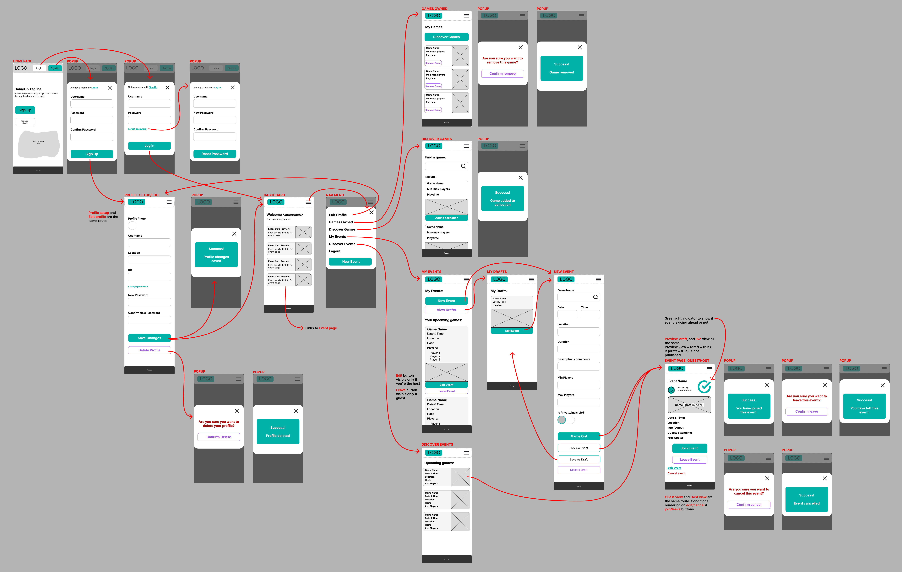

### Mobile Wireframes

Notes have been added to the mobile views only. Table and desktop views are un-annotated.

Home page and login popups:

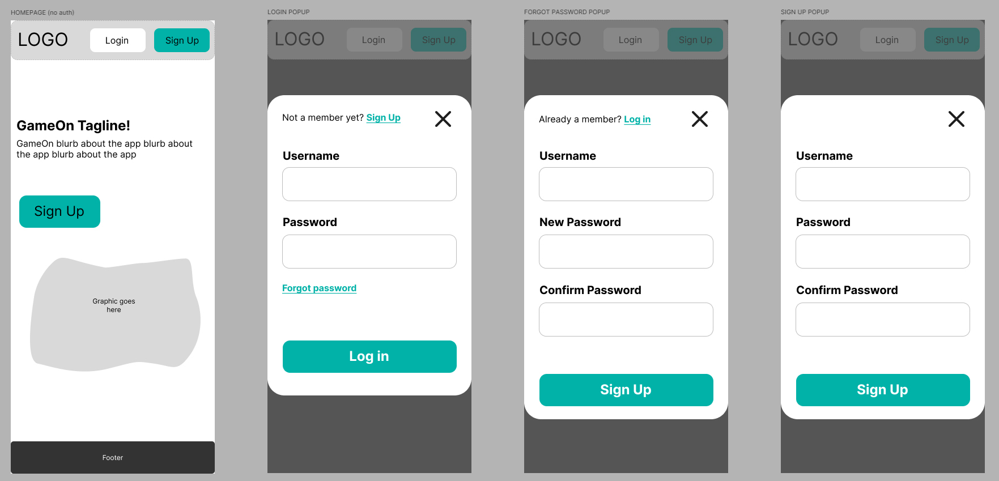

Profile setup and editing:

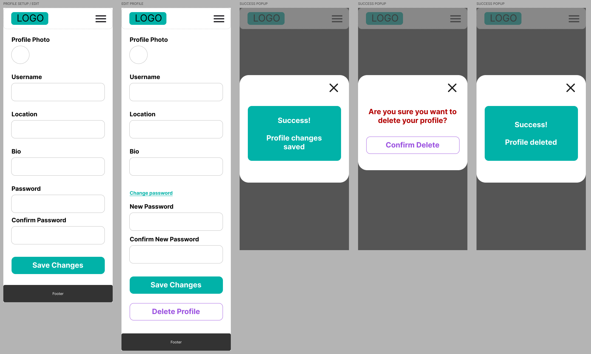

Dashboard and nav-menu:

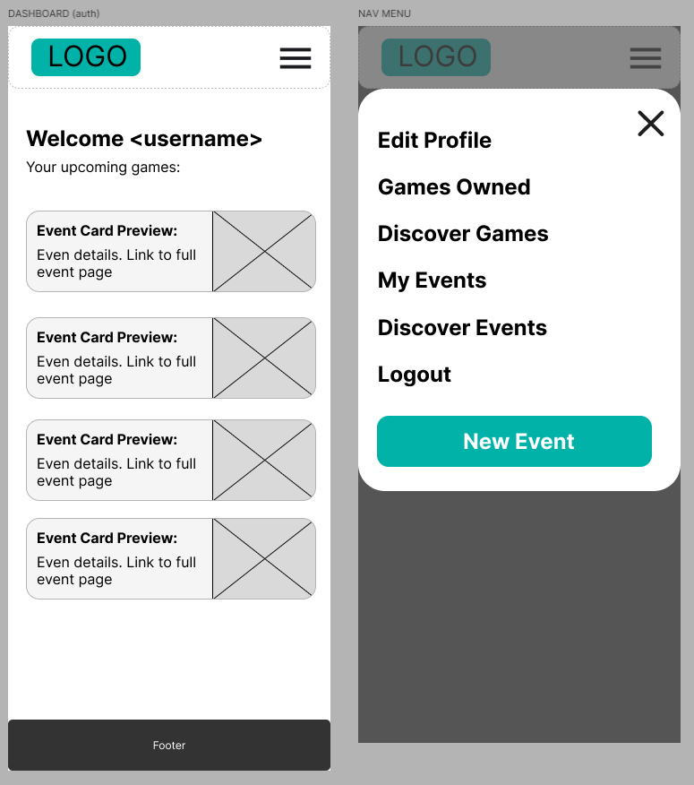

Games owned and games search

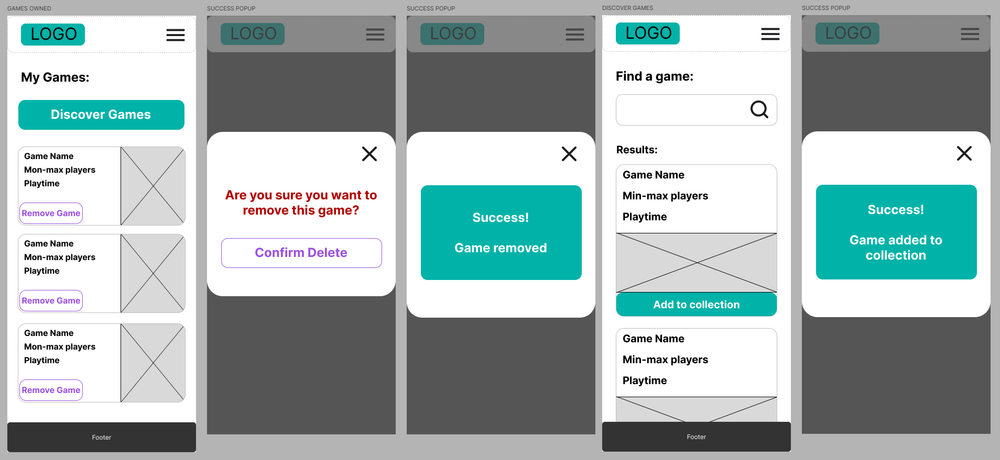

Events, event drafts, new event, and uplcoming events:

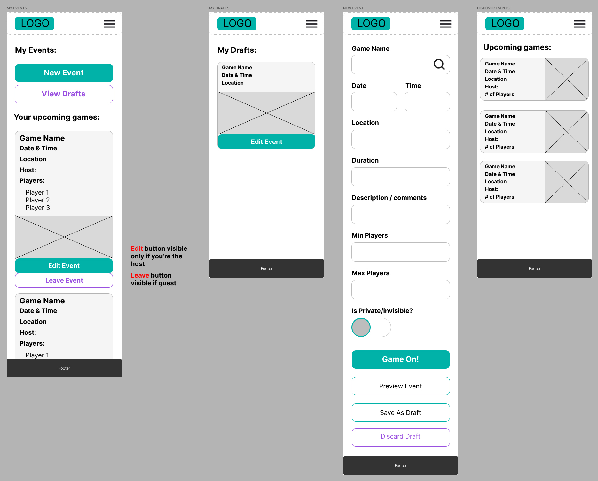

Single event page. Guest and host views:

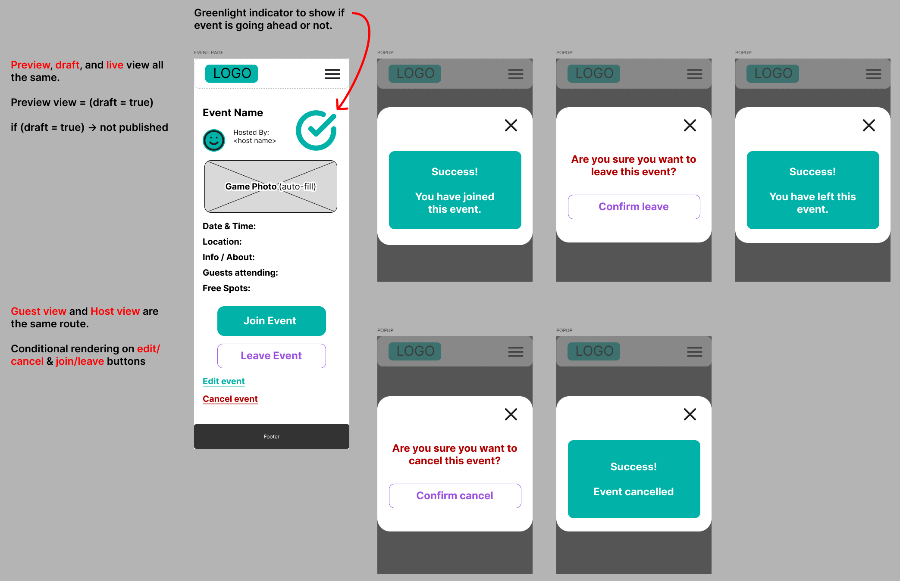

### Tablet Wireframes

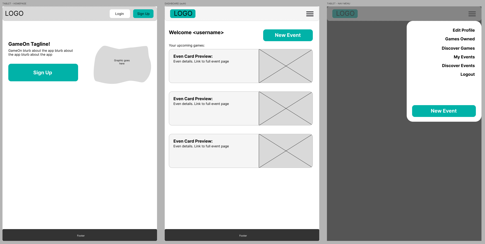

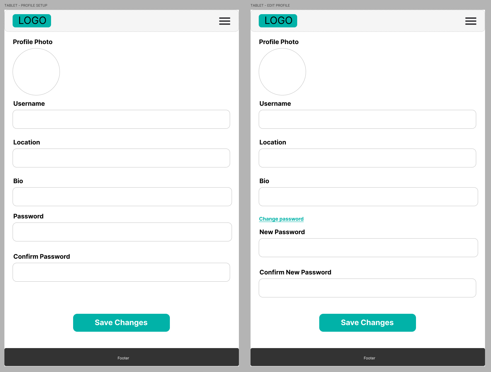

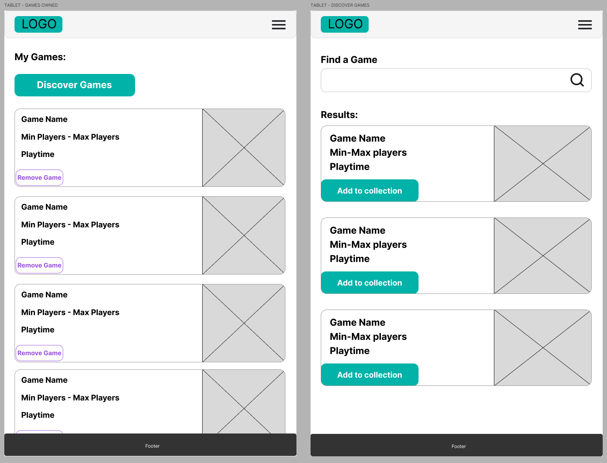

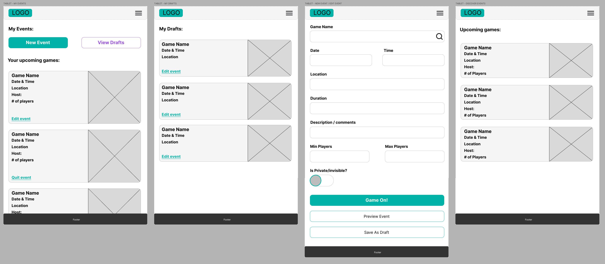

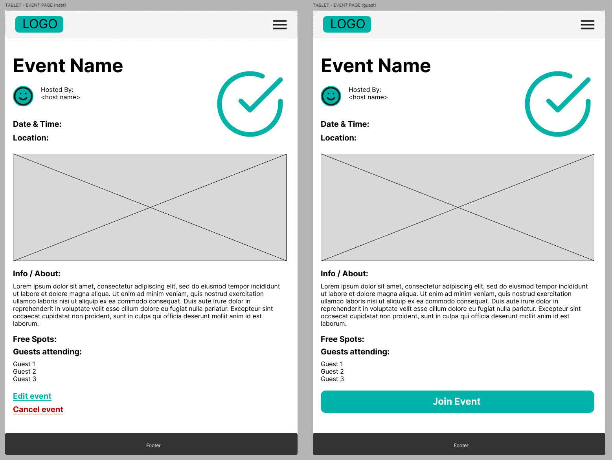

### Desktop Wireframes

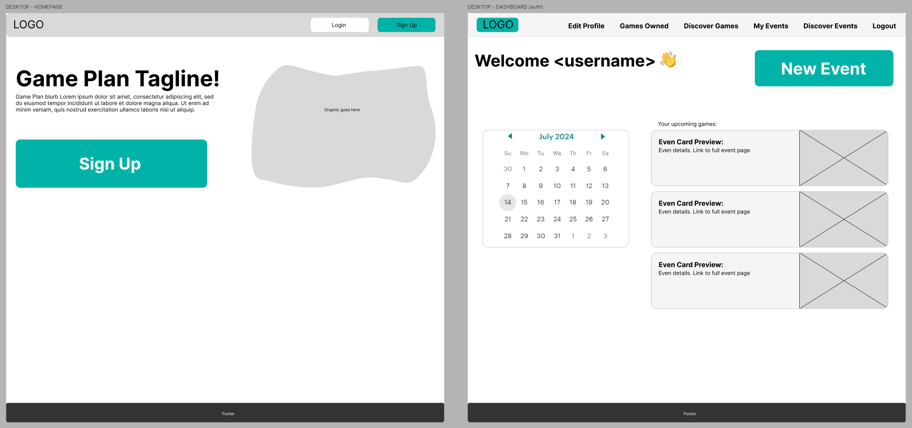

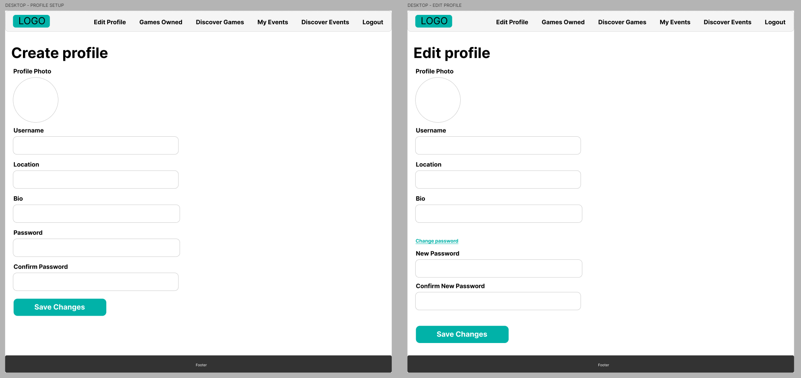

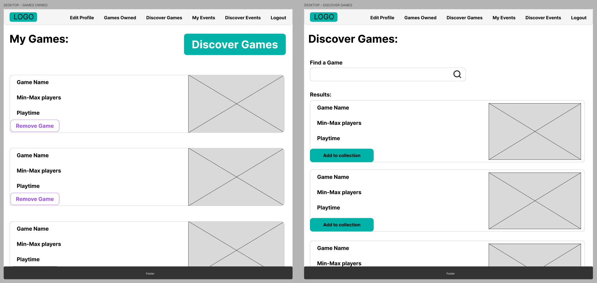

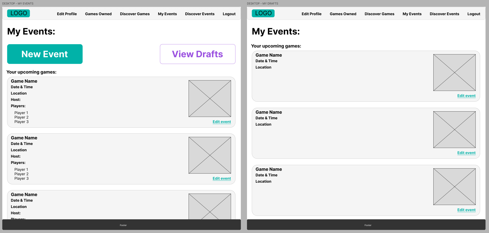

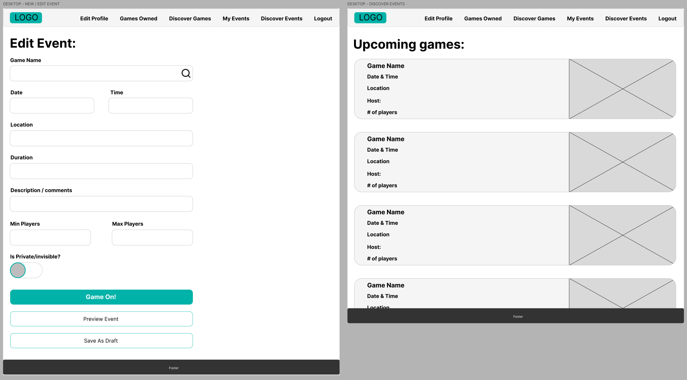

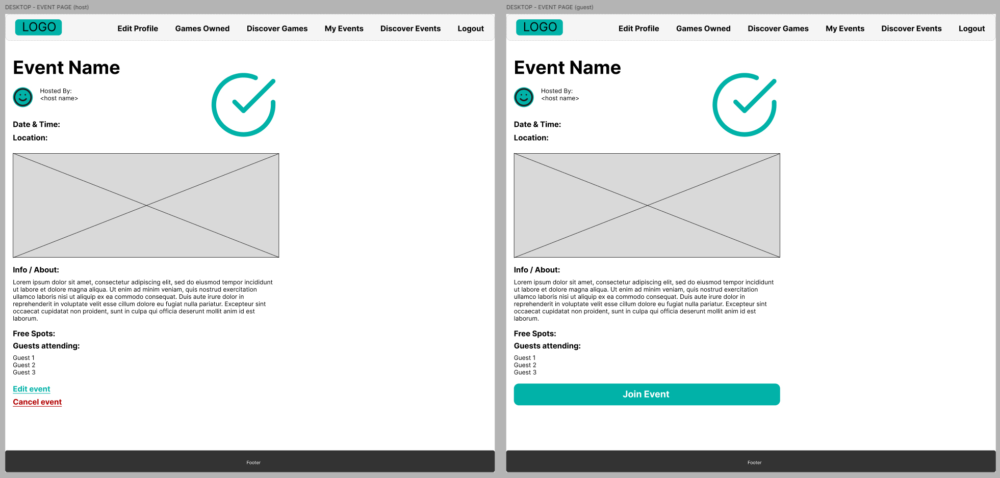

## Planning

